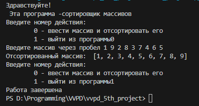

# The simplest array sorter ever
###### (maybe)
___

## Functions
File *third_project.py* contains three functions:
- selecton sort
- menu function
- main

## The concept 
How does sorting work? Of course, it's very *~~bad~~* simple. The essence of the work is to iterate through all the characters in a double loop.
```
def selection_sort(arr):
    """ sorts by choise """
    arr_lenght = len(arr)
    for i in range(arr_lenght):
        min_index = i
        for j in range(i+1, arr_lenght):
            if arr[j] < arr[min_index]:
                min_index = j
        arr[i], arr[min_index] = arr[min_index], arr[i]
    return arr
```

###### The principle of development can be described by a list:

- [x] Did I know about the bubble sorting method?
- [x] Did I know about the quick sort method?
- [x] Did I know about the merge sorting method?
- [ ] I chose one of these methods and strengthened my knowledge.


## pep8 standart 

The code is written according to the pep8 standard, which makes it convenient to read it. From the data collected by me, you can make a formula:
$$Bc * pep8 = N(Bc)$$
Where ___Bc___ is a bad code, ___pep8___ is a code standard and ___N(Bc)___ is not the worst code

## Usage example 


# Conclusion
There are inaccuracies in this project, but they are all explained by [this](https://www.youtube.com/watch?v=dQw4w9WgXcQ&ab_channel=RickAstley).

